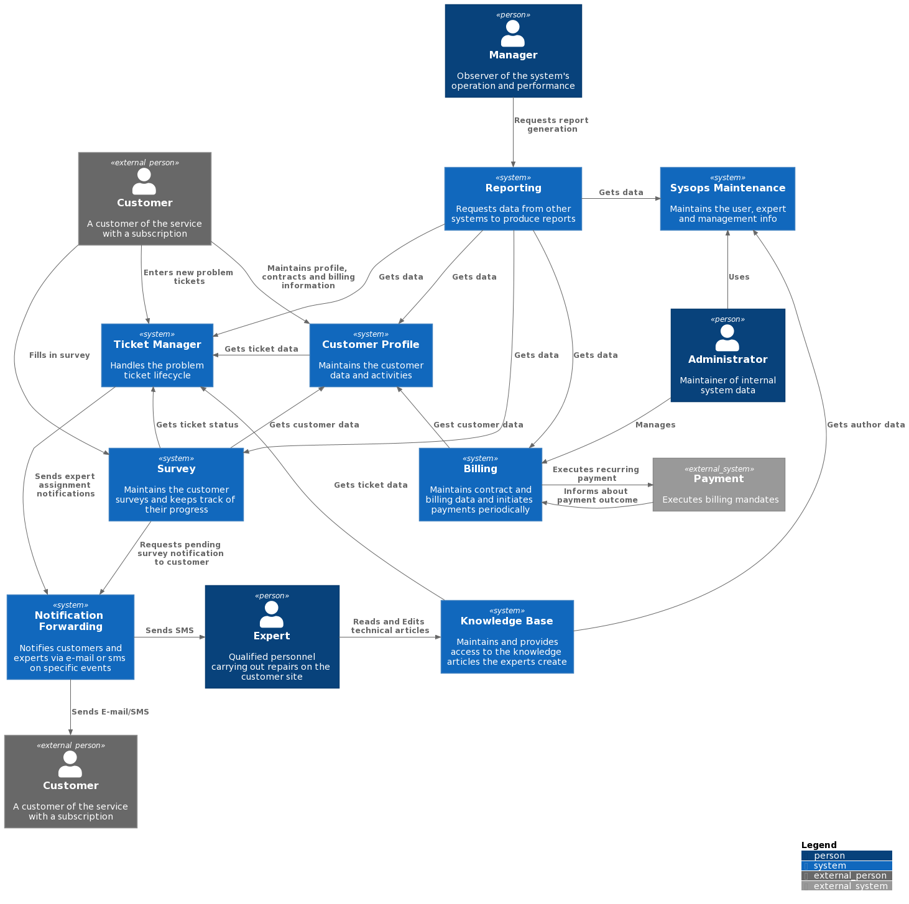
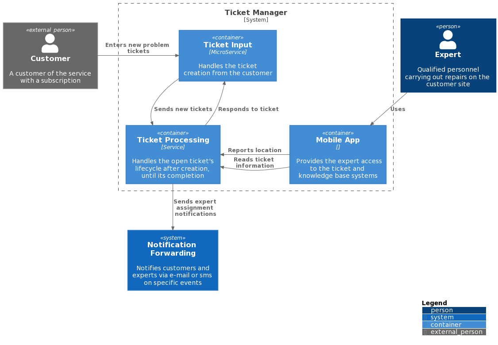
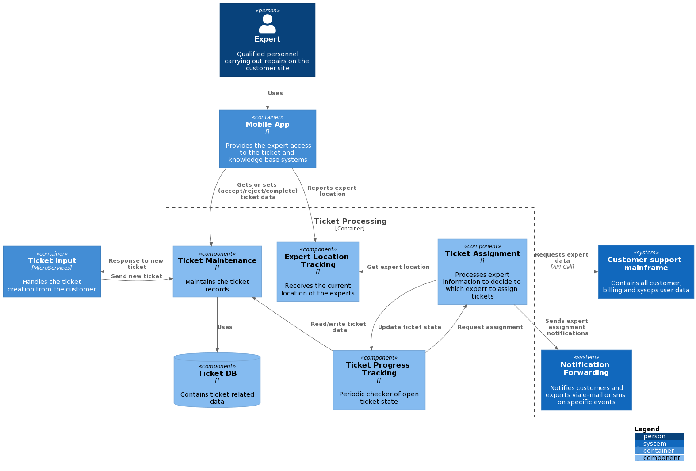
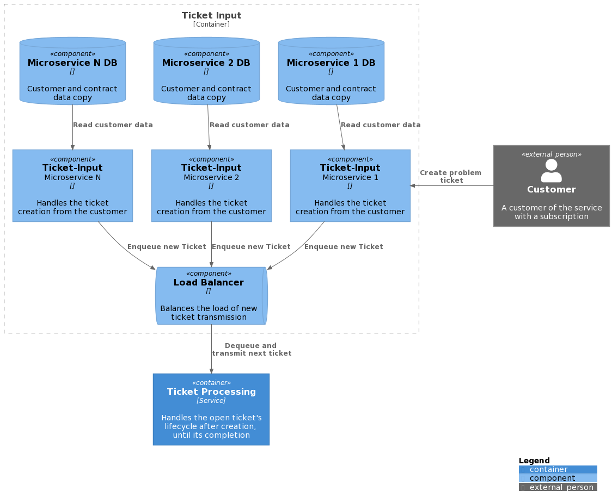
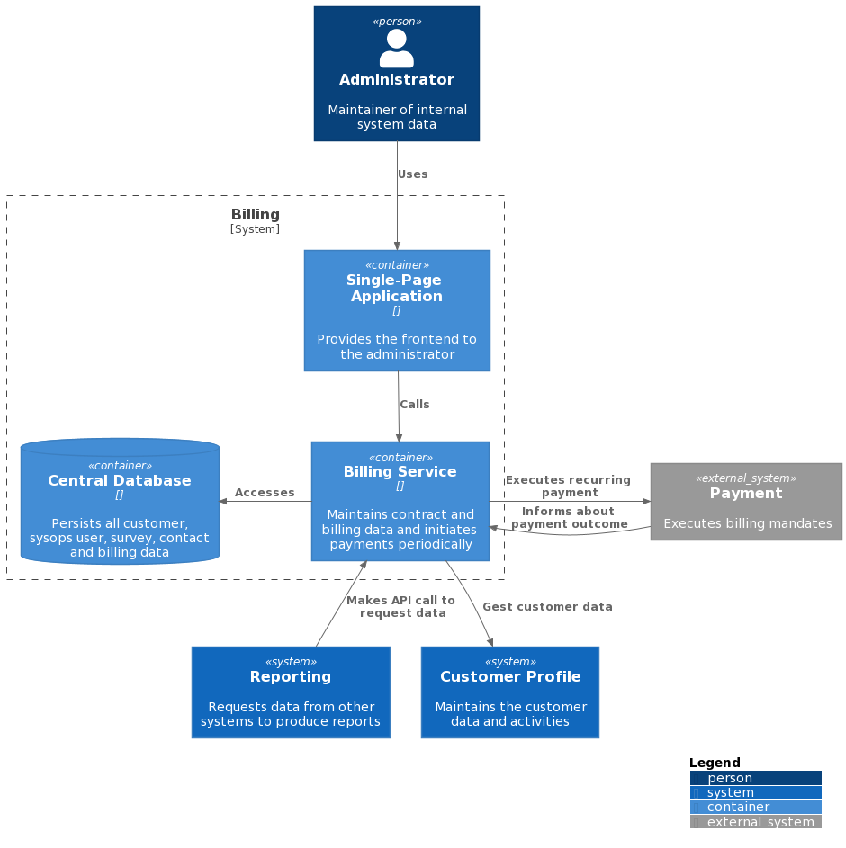
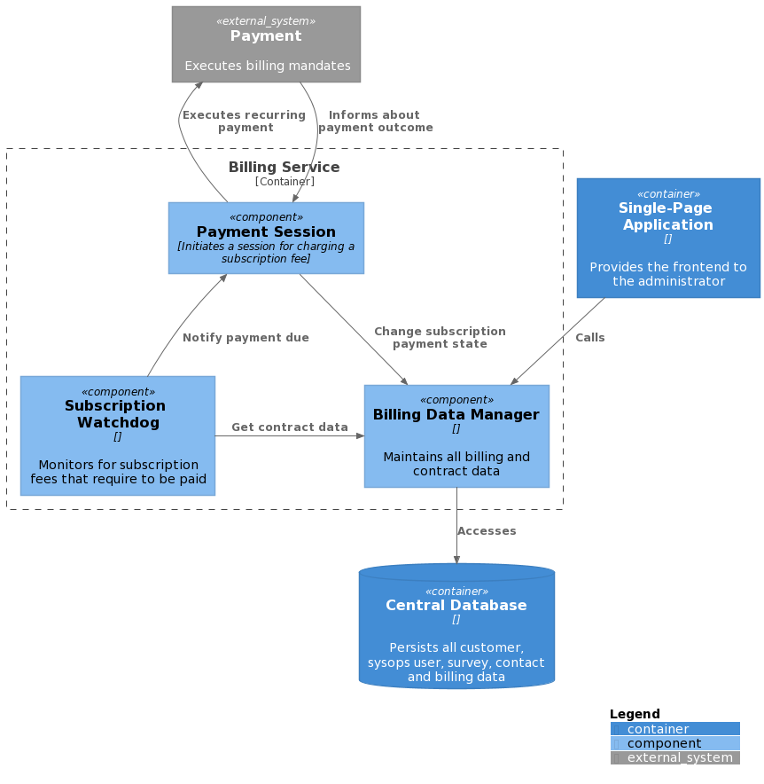

# ganymed Team 

# Architectural Kata

## Solution overview

In our solution we focused mostly on resolving the elasticity problem of the system, which was causing problem tickets to be lost or wrongly assigned. We also tackled the rigidity of the overall system, with regard to change, which made fixing existing and emerging bugs unfeasible.
Our overall approach is explained in the [SystemOverview](Doc/Adr/SystemOverview.md) ADR.

## Documenting
To document our solution we employed the C4 Architectural documentation model. We used [PlantUML](https://plantuml.com/) and the [C4 Plant UML stdlib](https://github.com/plantuml-stdlib/C4-PlantUML) to prepare the diagrams.

# Table of Contents
* [Context Diagram](context-diagram)
* [Container/Component Diagrams](container-diagrams)
    * [Ticket Manager System](Ticket-Manager-System)
        * [Ticket Processing Container](Ticket-Processing-Container)
        * [Ticket Input Container](Ticket-Input-Container)
    * [Billing System](Billing-System)
        * [Billing Container](Billing-Container)
    

## Context Diagram
Below is the context diagram of our solution. Customer actor is displayed on multiple locations to help the drawing algorithm.
Each of the displayed Systems, along with its Components where applicable, will be elaborated in the following sections.

## Container/Component Diagrams

### Ticket Manager System 

#### Ticket Processing Container

#### Ticket Input Container

Here lies the core of our solution. In the [Ticket System](Doc/Adr/TickectSystem.md) and [Ticket Input Datatables](Doc/Adr/TicketInputDatatables.md) ADRs you can read about the rationale behind choosing the micro-service architecture for the ticket input process, as well about the micro-service database content.

## Billing System

### Billing Container
